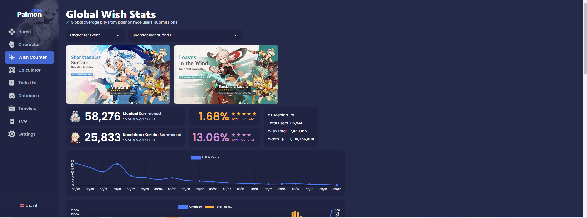
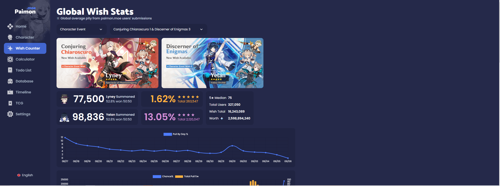

# GenshinGachSimulator
## Abstract
It has been a while for Genshin Impact to release the latest 5.0 Version. Everyone might already tried to pull the latest banner, and there is a new system called 'Capturing Radiance'. After viewing the stats shared in paimon.moe, I found that there reason is still almost the same. For the details of Genshin Wish's system, can refer to this link: [Wish | Genshin Impact Wiki]([https://github.com/lenzyh/GenshinGachaSimulator](https://genshin-impact.fandom.com/wiki/Wish)). In general gacha systems, players often believe that increasing the number of pulls will lead to higher chances of getting rare items. However, due to the nature of RNG (random number generation), outcomes remain unpredictable, even with a large number of pulls. And hence this article aims to investigate the underlying mechanic of Genshin's Wish system and it's latest feature  "Capturing Radiance".

After 5.0

Before 5.0

## Hypothesis
Based on the rule stated, to calculate the guaranteed 5-star character with a pity mechanism, I will use a stepwise increasing probability based on the number of pulls made. Here's a breakdown:

Version 1:
  \[
  P(\text{Capture}) = C \quad \text{(e.g., } C = 0.1\text{)}
  \]
- **Total Probability of Winning**:
  \[
  P(\text{Total Win}) = P(\text{Win}) + P(\text{Loss}) \times P(\text{Capture})
  \]

Version 2: Capturing Radiance:
  \[
  P(\text{Win}) = 
  \begin{cases} 
  0.5 & \text{if } \text{lose\_streak} \in \{0, 1\} \\
  0.75 & \text{if } \text{lose\_streak} = 2 \\
  1.0 & \text{if } \text{lose\_streak} > 2 
  \end{cases}
  \]
