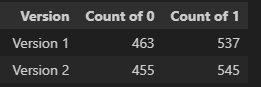

# GenshinGachSimulator
## Abstract
It has been a while for Genshin Impact to release the latest 5.0 Version. Everyone might already tried to pull the latest banner, and there is a new system called 'Capturing Radiance'. After viewing the stats shared in paimon.moe, I found that there reason is still almost the same. For the details of Genshin Wish's system, can refer to this link: [Wish | Genshin Impact Wiki]([https://github.com/lenzyh/GenshinGachaSimulator](https://genshin-impact.fandom.com/wiki/Wish)). In general gacha systems, players often believe that increasing the number of pulls will lead to higher chances of getting rare items. However, due to the nature of RNG (random number generation), outcomes remain unpredictable, even with a large number of pulls. And hence this article aims to investigate the underlying mechanic of Genshin's Wish system and it's latest feature  "Capturing Radiance".

After 5.0

Before 5.0

## Hypothesis
Based on the rule stated, to calculate the guaranteed 5-star character with a pity mechanism, I will use a stepwise increasing probability based on the number of pulls made. Here's a breakdown:

### Version 1: Basic Capture Probability

### Version 2: Capturing Radiance

And below will be one of the simulated result of these 2 version of simulators after 1000 pulls
###

###
Version 1: 53.70% banner 5-star rate
Version 2: 54.50% banner 5-star rate

The corresponding percentage are still very similar 

The mechanism of the overall flow:

## Conclusion
In this analysis of Genshin Impact's Wish system, particularly the new "Capturing Radiance" feature introduced in Version 5.0, we explored the mechanics behind gacha pulls and the associated probabilities of acquiring rare items. Our simulations of two distinct versions demonstrated that even with varying probabilities, the resulting banner 5-star rates remained remarkably similar, with Version 1 achieving a rate of 53.70% and Version 2 achieving 54.50%.

This reinforces the idea that while adjustments to the system may offer nuanced changes in the mechanics, the fundamental nature of RNG in gacha systems means that outcomes can still converge around a similar expected probability. Players should remain mindful that despite increased numbers of pulls and enhancements to the system, the unpredictability of RNG ensures that outcomes can vary widely, and there are no guarantees of obtaining desired characters or items.

In summary, the "Capturing Radiance" system retains the core principles of the gacha mechanism while providing new opportunities for players to engage with the game. Further exploration and analysis may yield deeper insights, but this simulation lays a solid foundation for understanding how these systems operate within the context of Genshin Impact.
